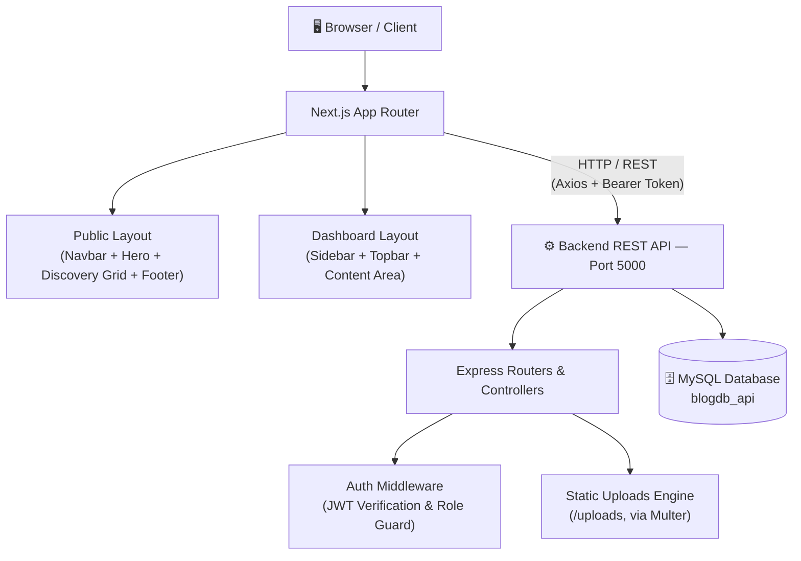

<div align="center">

# 📖 BlogSpace
### Full-Stack Technical Publishing Platform

*Enterprise-grade, role-based blogging and content management system*

[](https://nextjs.org/)
[](https://react.dev/)
[](https://tailwindcss.com/)
[](https://expressjs.com/)
[](https://www.mysql.com/)
[](https://jwt.io/)
[](#license)


</div>

---

## 📑 Table of Contents

- [1. Project Overview](#1-project-overview)
- [2. System Architecture](#2-system-architecture)
- [3. Main Features](#3-main-features)
- [4. Technologies Used](#4-technologies-used)
- [5. Backend Dependency & Database](#5-backend-dependency--database)
- [6. Environment Configuration](#6-environment-configuration)
- [7. Installation & Getting Started](#7-installation--getting-started)
- [8. Application Routes & Navigation Map](#8-application-routes--navigation-map)
- [9. User vs. Admin Functionality Matrix](#9-user-vs-admin-functionality-matrix)
- [10. REST API Specification](#10-rest-api-specification)
- [11. Application Visual Walkthrough](#11-application-visual-walkthrough-screenshots)
- [License](#license)

---

## 1. Project Overview

**BlogSpace** is an end-to-end platform designed for software engineers, automated testers, and tech enthusiasts to publish and consume specialized articles.

- 🌐 **Unauthenticated guests** can search, filter, and read technical articles with optimized page transitions.
- ✍️ **Registered members** gain access to an authenticated workspace to author, edit, and delete publications, and manage profile details including avatar uploads.
- 🛡️ **Platform administrators** possess elevated rights to manage user activation states and supervise all platform content.

---

## 2. System Architecture

The project adheres to a strict client-server decoupling standard:



| Layer | Responsibility |
|---|---|
| **Client** | Next.js (App Router), Tailwind CSS, Lucide Icons |
| **Transport** | Axios with Bearer Token interceptors |
| **API** | Express.js — routers, controllers, Multer, JWT middleware |
| **Storage** | MySQL relational database (`blogdb_api`) |

---

## 3. Main Features

### 3.1 Guest Discovery & Public Consumption
- **Hero & Public Feed** — recent publications in responsive grids with cover visuals, categories, creation dates, and author info.
- **Multi-Parametric Filter** — search by title keyword (`?title=...`), category (`?category=...`), or both combined.
- **Article Reader** (`/blogs/[id]`) — article body, author info, timestamps, estimated reading time, and clipboard sharing.

### 3.2 Authentication & Password Lifecycle
- **JWT Authentication** — stateful token issuance on login, validated across route transitions via Axios interceptors (`Authorization: Bearer <token>`).
- **Registration & Verification** — email format checks, matching passwords, unique account constraints.
- **Password Recovery Pipeline** — forgot-password email dispatch, tokenized reset (`/reset-password/[token]`), and authenticated in-app password update (`/dashboard/change-password`).

### 3.3 Authoring & Content Management (CRUD)
- **Publishing Interface** — validated payload (`blogTitle`, `blog`, `category`) with no client-exposed user IDs.
- **Dashboard Data Table** — sortable listing of published works with category tags and action triggers.
- **Inline Editor** (`/dashboard/blogs/[id]/edit`) — pre-populated fields for seamless updates.
- **Safe Deletion Protocol** — confirmation modal (`ConfirmDialog`) before any `DELETE` request.

### 3.4 Profile Management & Image Processing
- **Read-Only Constraints** — role and email fields locked for system integrity.
- **Name Updates** — edit first/last name via `PUT /api/users/profile/update`.
- **Avatar Upload Pipeline** — Multer-based multipart handling, validating type (JPEG/JPG/PNG/WebP) and size (≤ 2MB).

### 3.5 Administration & Security
- **Role-Based Guards (RBAC)** — middleware blocks regular users from `/admin/*` with an Access Denied guard.
- **User Directory** — tabular listing of all accounts with identity, role, and status.
- **State Toggling** — instant activation/deactivation via `PATCH /api/users/:id/status`.

---

## 4. Technologies Used

| Category | Stack |
|---|---|
| **Frontend** | Next.js (App Router), React, Tailwind CSS, Lucide React, Axios |
| **Backend** | Node.js, Express.js, MySQL (`mysql2/promise`), JWT, Multer |
| **DevOps & Tooling** | Git, GitHub, Postman, VS Code |

---

## 5. Backend Dependency & Database

The frontend requires the Node.js/Express REST server to run concurrently on port `5000` with a connected MySQL instance.

**Database Setup**

1. Open your MySQL client (MySQL Workbench, phpMyAdmin, or CLI).
2. Create the database:
   ```sql
   CREATE DATABASE blogdb_api;
   ```
3. Run schema migrations and seeders:
   ```bash
   cd blog-rest-api
   npm run seed   # or: node seed.js
   ```

---

## 6. Environment Configuration

**Frontend** — `.env.local` (project root)
```env
NEXT_PUBLIC_API_BASE_URL=http://localhost:5000/api
```

**Backend** — `.env` (project root)
```env
PORT=5000
DB_HOST=localhost
DB_USER=root
DB_PASSWORD=your_password
DB_NAME=blogdb_api
JWT_SECRET=your_jwt_secret_key
```

---

## 7. Installation & Getting Started

**1. Launch the Backend Server**
```bash
cd blog-rest-api
npm install
node app.js
# Expected output: "Server is running on port 5000"
```

**2. Launch the Next.js Client**
```bash
cd blog-platform-client
npm install
npm run dev
# Server accessible at http://localhost:3000
```

---

## 8. Application Routes & Navigation Map

| Path | Access Level | Description |
|---|---|---|
| `/` | Public (Guest) | Landing feed, search bar, category filters, blog cards |
| `/blogs/[id]` | Public (Guest) | Detailed view of a specific blog post |
| `/login` | Public | User credential login |
| `/register` | Public | Account registration |
| `/forgot-password` | Public | Password recovery request form |
| `/reset-password/[token]` | Public | Tokenized reset password interface |
| `/dashboard` | Authenticated | User metrics overview and recent publications |
| `/dashboard/blogs` | Authenticated | List of user-owned blogs (all blogs for admins) |
| `/dashboard/blogs/create` | Authenticated | Article publishing form |
| `/dashboard/blogs/[id]/edit` | Authenticated | Article update and editing form |
| `/dashboard/profile` | Authenticated | Profile overview and avatar upload |
| `/dashboard/change-password` | Authenticated | In-app password update |
| `/admin/users` | Admin Only | User directory and activation/deactivation control |

---

## 9. User vs. Admin Functionality Matrix

| Capability / Permission | Guest | Regular User | Administrator |
|---|:---:|:---:|:---:|
| Browse Public Feed & Search | ✅ | ✅ | ✅ |
| View Full Article Content | ✅ | ✅ | ✅ |
| Create Articles | ❌ | ✅ | ✅ |
| View Own Articles in Dashboard | ❌ | ✅ | ✅ |
| Edit & Delete Own Articles | ❌ | ✅ | ✅ |
| Edit & Delete Any Article | ❌ | ❌ | ✅ |
| Update Profile & Upload Avatar | ❌ | ✅ | ✅ |
| Change Account Password | ❌ | ✅ | ✅ |
| Access Admin Directory | ❌ | ❌ | ✅ |
| Activate / Deactivate Accounts | ❌ | ❌ | ✅ |

---

## 10. REST API Specification

### Authentication — `/api/auth`
| Method | Endpoint | Description |
|---|---|---|
| `POST` | `/api/auth/register` | Register a new account |
| `POST` | `/api/auth/login` | Authenticate and receive a JWT |
| `POST` | `/api/auth/forgot-password` | Send a password recovery link |
| `PATCH` | `/api/auth/reset-password/:token` | Reset password using a valid token |

### Blog Management — `/api/blogs`
| Method | Endpoint | Description |
|---|---|---|
| `GET` | `/api/blogs` | Retrieve articles (`?title=`, `?category=`) |
| `GET` | `/api/blogs/:id` | Retrieve full article details by ID |
| `POST` | `/api/blogs` | Create a new post *(Authenticated)* |
| `PUT` | `/api/blogs/update/:id` | Update an existing article *(Author/Admin)* |
| `DELETE` | `/api/blogs/delete/:id` | Delete an article *(Author/Admin)* |

### User Management — `/api/users`
| Method | Endpoint | Description |
|---|---|---|
| `GET` | `/api/users/profile` | Fetch current user profile |
| `PUT` | `/api/users/profile/update` | Update user names |
| `PATCH` | `/api/users/profile/image` | Upload avatar image (`multipart/form-data`) |
| `PATCH` | `/api/users/password` | Change password for authenticated session |
| `GET` | `/api/users` | List all registered users *(Admin only)* |
| `PATCH` | `/api/users/:id/status` | Toggle user active state *(Admin only)* |

---

## 11. Application Visual Walkthrough (Screenshots)

> Place captured screenshots inside `/public/screenshots/` in the Next.js project, matching the file names referenced below.

### 11.1 Public Guest Journey
| Guest Homepage | Real-time Search & Filter | Article Details View |
|---|---|---|
|  |  |  |

### 11.2 Authentication & Security
| Login Screen | Registration Form | Password Recovery |
|---|---|---|
|  |  |  |

### 11.3 Authenticated User Dashboard
| Dashboard Overview | My Blogs Table | Publishing Form |
|---|---|---|
|  |  |  |

| Delete Confirmation | Profile & Avatar Upload | Change Password |
|---|---|---|
|  |  |  |

### 11.4 Admin Control & Route Guards
| User Directory & Status Control | Route Access Denied Guard |
|---|---|
|  |  |

---

## License

Distributed under the **MIT License**.

<div align="center">

Made with ❤️ using Next.js & Express.js by Ebnul Ahsan

</div>
